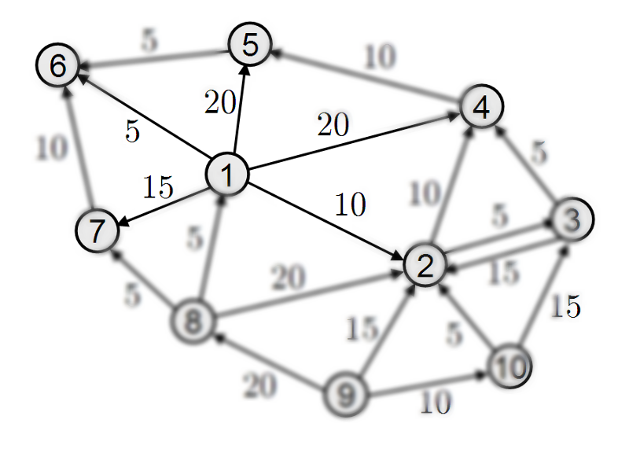
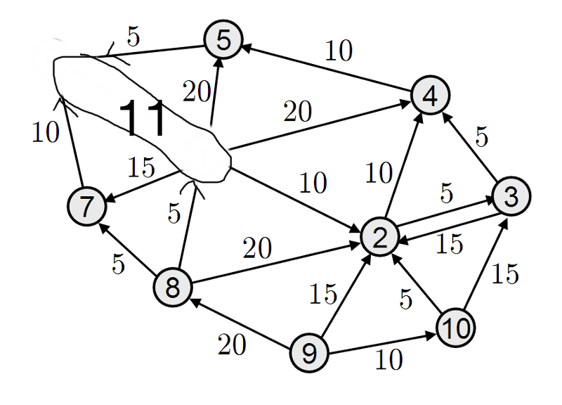
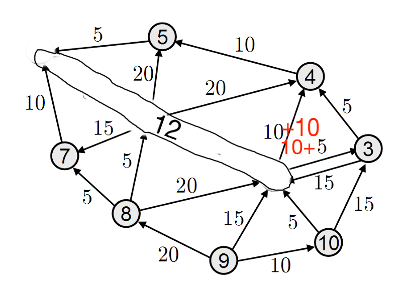
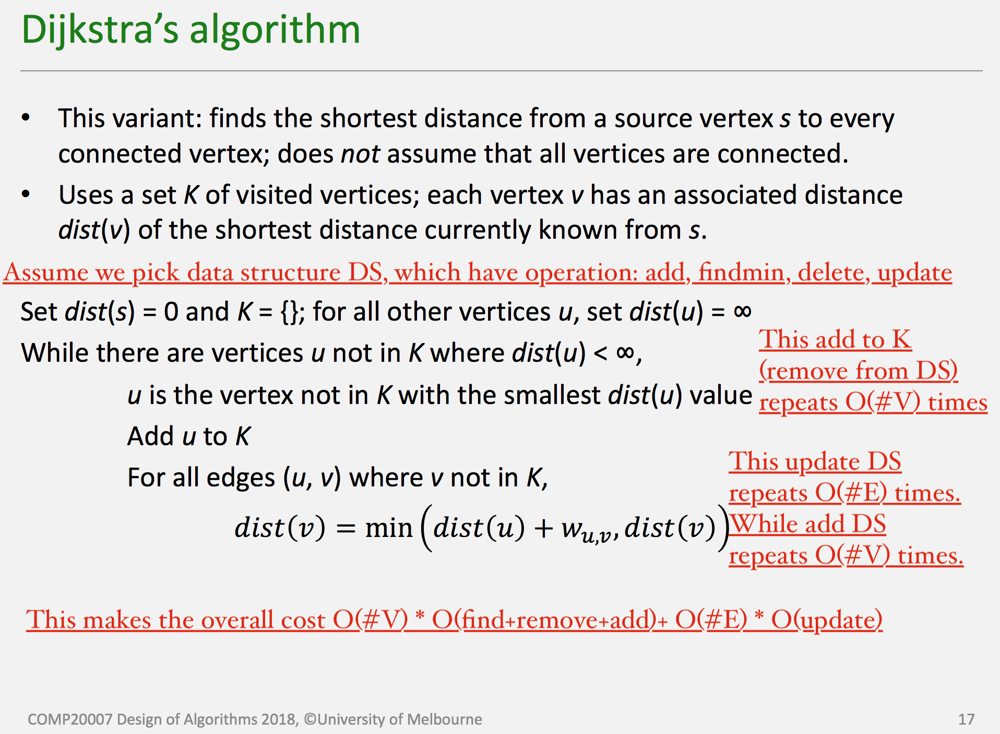
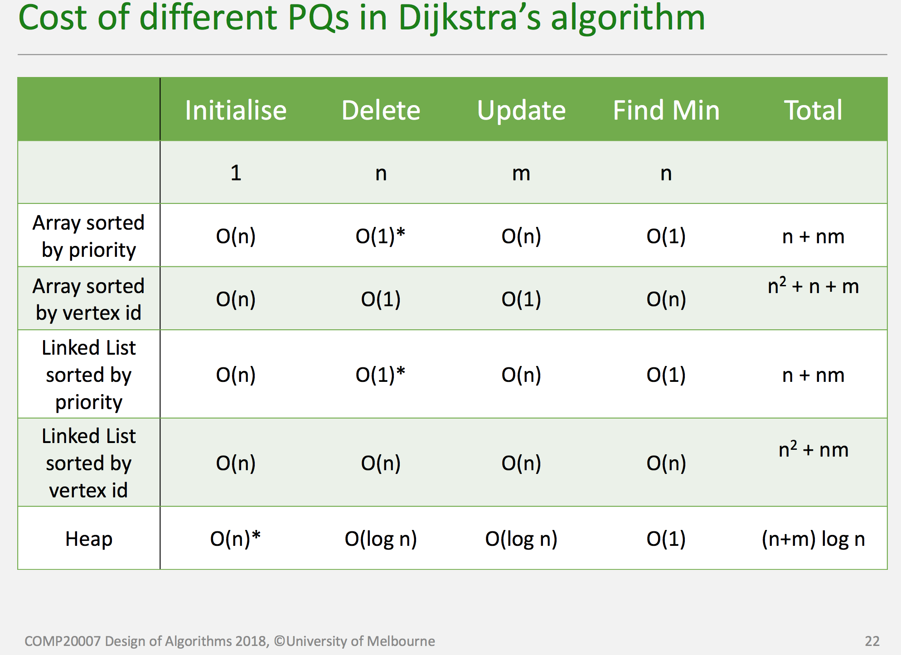

# About Time Complexity with full map explore dijkstra algorithm
 
Dijkstra algorithm is always been a hard topic for some students in university. But it's in fact pretty simple and intuitive to understand. In this short blog, I will discuss some of dijkstra algorithm's intuition and implementation + time complexity details.
## Detailed implementation(In C)
Provided the following data structure:

    typedef struct {
        bool processed[MAXV];   /* which vertices have been processed */ # Here we used to denote the shortest path to V has been found.
        bool discovered[MAXV];  /* which vertices have been found */
        int parent[MAXV];       /* discovery relation */
        int entry_time[MAXV];   /* entry time of dfs*/
        int exit_time[MAXV];    /* entry time of dfs*/
        int time;               /* record the current entry time */
    } Search;

    typedef struct edgenode_s {
        int y;                   /* adjacency info */
        int weight;              /* edge weight, if any */
        struct edgenode_s *next; /* next edge in list */
    } Edgenode;

    typedef struct {
        Edgenode *edges[MAXV];   /* adjacency info */
        int degree[MAXV];        /* outdegree of each vertex */
        int nvertices;           /* number of vertices in graph */
        int nedges;              /* number of edges in graph */
        bool directed;           /* is the graph directed? */
        bool weighted;           /* is the graph weighted? */
        Search search;
    } Graph;
    
Dijkstra algorithm is simply implemented by:

    Dist *dijkstra_search(Graph *g, int start) {
        ... # Some initializations
        for (i = 0; i < g->nvertices; i++) {
            dist[i] = INT_MAX;
        }

        dist[start] = 0;
        g->search.discovered[start] = TRUE;
        heap_insert(h, (float)dist[start], start);

        # The heap h, also acts as the current node that's been discovered and path not found. Meaning in the same connected component
        while (heap_show_nele(h) > 0) {
            v=heap_remove_min(h);
            g->search.processed[v] = TRUE; # The min distance to v has been found!
            p=g->edges[v];
            while (p!=NULL) {
                y = p->y;
                if (g->search.processed[y]==TRUE) {
                    p = p->next;
                    continue;
                }
                w = p->weight;
                if (g->search.discovered[y]==FALSE) {   /* If hasn't found node */
                    g->search.discovered[y]=TRUE;       /* We set the status of node be FOUND */
                    dist[y] = (dist[v]+w);              /* Update node's distance(Because it must be infinite before) */
                    heap_insert(h, (float)dist[y], y);  /* Put into heap (Correspond to ADD) */
                    g->search.parent[y] = v;
                } else if (dist[y] > dist[v]+w) {       /* Found a shorter path */
                    dist[y] = dist[v]+w;
                    heap_change_key(h, y, (float)dist[y]);
                    g->search.parent[y] = v;
                }
                p = p->next;
            }
        }
    ... # Some further details
    }
    
My implementation, due to the use of non-specific structure. Is a bit messy and complex. With appropriate data structure, these can be reduced to just few lines long.

## Intuition of this algorithm

Since we start from a single point: start (which we denote as `s`), we can think of the graph now as an explicit graph, that is, we know nothing except for ourselfs and out neighbours, which we denote as `n`.
  
The key observation here is, except for the `n` which has the minimal distance to us. All other points with distance larger than `dist(n)`, might have some other path to them that is shorter. Which is shown as the diagram below:

> Figure adapted from [Here](https://medium.com/@keithwhor/using-graph-theory-to-build-a-simple-recommendation-engine-in-javascript-ec43394b35a3)

If the graph doesn't have any negative edges (which dijkstra can't handle), we can be pretty sure that, start from node s=`1` to node s=`6`, 5 will be the minimal distance. Since every passage through other nodes to node `6` will be at least same as the distance to that node which is certainly more than `dist(6)`=5.
Then, use the thought of recursion, we can consider `1` and `6` merged to be the same entity. As shown below:

Let's Try another iteration:

Note now, since the node `2` we updated has some outgoing edges. We can't treat these edge same weight as before, because we still start from node `1` instead of the imagined node `12`. We will update the edge's weight (as 10 + original distance).(Note, here the weight I'm referring to is the same as the distance from any nodes to `1`).
We will repeat such process till we traversed the whole graph's reachable node from `1`. And this sums the intuition of dijkstra algorithm.

## Time complexity analysis
> The following figs are referenced from Prof Justin.Z's lecture notes for COMP20007

To compute the complexity after understanding the mechanics of algorithm is very simple.
There are in total #V vertices and #E edges. We only check each edge one, add each vertices to the heap once during the search.
And this graph summarizes the operations and time we needed to process the graph.

And the overall summary is here

