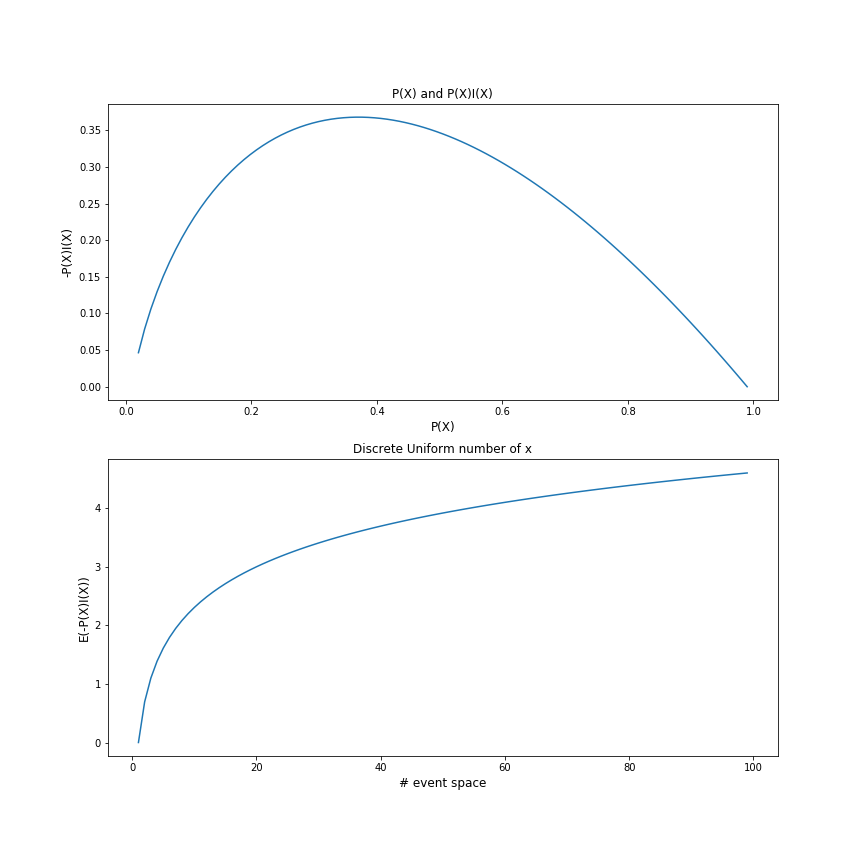
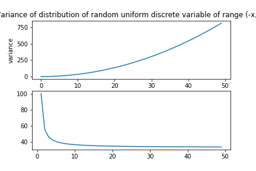

# Understanding with Variance and Entropy wrt to distribution
 
## Variance and Entropy are two similiar idea in a sense that both of them can describe how 'splitted' the distribution is. But they have very different identities.
 
To illustrate this. Let's first look at some figures and then talk about intuition behind them.

> Fig1: Relation between probability distribution and entropy(discrete) See [prog1](./fig1.py)

> Fig2: Relation between distribution range/split and variance See [prog2](./fig2.py)

These graphs clearly demonstrates the difference between variance and entropy. The value of variance changes dramatically (polynomial growth) with the change of range of distribution(with the same amount of points). When the range is fixed, increased number of points will reduce the amount of variance it have. It captures the distance between the mean value and all it's other points. So we can sum variance as a attribute of spacial relation between the mean value and all values.

However, things are different with entropy. It didn't incorporate any distance into the equation, but only the probability. And we can also see, that information 'saturates' as the number of discrete values increases.

Another example will be for a continuous random variable X with empirical distribution near `X = -1e10` and `X= +1e10`. The Variance will be dramatic. But it contains very low information.

As for categorial random variable (nominal feature). The concept mean, variance doesn't even exist for them. Because they don't contain special information.